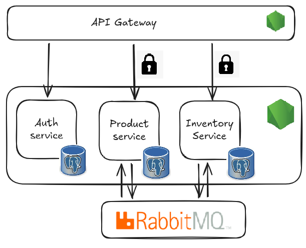

# E-Commerce Microservices Backend (WIP)

A **work-in-progress learning project** exploring microservices architecture for an e-commerce backend.  
Built with **Node.js** and **TypeScript**, containerized with **Docker**, and powered by **PostgreSQL** and **RabbitMQ** for asynchronous communication between services.

## Tech Stack
- **Node.js** + **TypeScript** — Service development
- **PostgreSQL** — Relational database
- **RabbitMQ** — Message broker
- **Docker** + **Docker Compose** — Containerization and orchestration

## Architecture Diagram (till now)

## Services implemented -
| Service Name        | Responsibility / Functionality                     |
|--------------------|----------------------------------------------------|
| **Auth Service**    | Manage users, authentication, and sessions       |
| **Product Service** | Store product information and availability       |
| **Inventory Service** | Manage available and reserved stock of products |

## Services planned -
#### 1. Cart Service
#### 2. Order Service